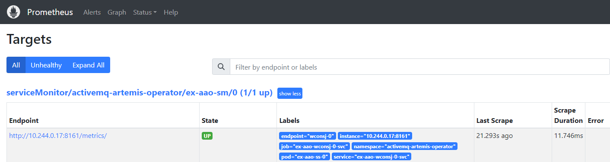

# Setting Environment
According to [official documentation](https://github.com/prometheus-operator/kube-prometheus#minikube)，we can use the below cmd to start up minikube，but the dfault value of CPU (2 core) is not enough .
```shell
$ minikube delete && minikube start --kubernetes-version=v1.24.11 \
--cpus=4 \
--memory=6g \
--bootstrapper=kubeadm \
--extra-config=kubelet.authentication-token-webhook=true \
--extra-config=kubelet.authorization-mode=Webhook \
--extra-config=scheduler.bind-address=0.0.0.0 \
--extra-config=controller-manager.bind-address=0.0.0.0
```
# Install Pormeutheus
* [QuickStart](https://github.com/prometheus-operator/kube-prometheus/tree/v0.12.0#quickstart)
```shell
cd kube-prometheus-v0.12.0 
kubectl apply --server-side -f manifests/setup

kubectl wait \
 --for condition=Established \
 --all CustomResourceDefinition \
 --namespace=monitoring

kubectl apply -f manifests/
cd ..
```
* [Access UIs](https://github.com/prometheus-operator/kube-prometheus/blob/v0.12.0/docs/access-ui.md)
  * Grafana:
    ```shell
    $ kubectl --namespace monitoring port-forward svc/grafana 3001:3000
    ```
    Then access via http://localhost:3001
  * Prometheus
    ```shell
    $ kubectl --namespace monitoring port-forward svc/prometheus-k8s 9090
    ```
    Then access via http://localhost:9090

# Install ActiveMQ Artemis Operator
According to the [official documentation](https://github.com/artemiscloud/activemq-artemis-operator/blob/v1.0.7/docs/getting-started/quick-start.md#deploying-the-operator).
```shell
cd activemq-artemis-operator-v1.0.7
kubectl create namespace activemq-artemis-operator
kubectl config set-context --current --namespace activemq-artemis-operator
kubectl create -f deploy/install
```
At this point you should see the activemq-artemis-operator starting up and if you check the logs you should see something like
```
$ kubectl get pod -n activemq-artemis-operator
NAME                                                   READY   STATUS    RESTARTS   AGE
activemq-artemis-controller-manager-5ff459cd95-kn22m   1/1     Running   0          70m
```
## Deploying the ActiveMQ Artemis Broker
Now that the operator is running and listening for changes related to our crd we can deploy [one of our basic broker custom resource examples](./activemq-artemis-operator-v1.0.7/examples/artemis-basic-deployment.yaml) which looks like
```yaml
apiVersion: broker.amq.io/v1beta1
kind: ActiveMQArtemis
metadata:
  name: ex-aao
spec:
  env:
    - name: TZ
      value: 'Asia/Taipei'
  deploymentPlan:
    size: 1
    enableMetricsPlugin: true
    image: placeholder
    messageMigration: true
    resources:
      limits:
        cpu: "500m"
        memory: "1024Mi"
      requests:
        cpu: "250m"
        memory: "512Mi"
  acceptors:
    - name: all-acceptors
      protocols: all
      port: 61616
      connectionsAllowed: 100
  console: 
    expose: true
```
Note in particular the **spec.image** which identifies the container image to use to launch the AMQ Broker. If it's empty or 'placeholder' it will get the latest default image url from config/manager/manager.yaml where a list of supported broker image are defined as environment variables.

To deploy the broker simply execute
```shell
kubectl create -f examples/artemis-basic-deployment.yaml -n activemq-artemis-operator
```

In a mement you should see one broker pod is created alongside the operator pod:

```shell
$ kubectl get pod
NAME                                                   READY   STATUS    RESTARTS   AGE
activemq-artemis-controller-manager-5ff459cd95-kn22m   1/1     Running   0          128m
ex-aao-ss-0                                            1/1     Running   0          23m
```
### Configuring the broker's privilege about prometheus
Now that the broker is running that we can deploy [privilege about prometheus ](./activemq-artemis-operator-v1.0.7/examples/artemis-basic-deployment.yaml) which looks like
```yaml
apiVersion: rbac.authorization.k8s.io/v1
kind: RoleBinding
metadata:
  labels:
    app.kubernetes.io/component: prometheus
    app.kubernetes.io/instance: k8s
    app.kubernetes.io/name: prometheus
    app.kubernetes.io/part-of: kube-prometheus
    app.kubernetes.io/version: 2.41.0
  name: prometheus-k8s
  namespace: activemq-artemis-operator
roleRef:
  apiGroup: rbac.authorization.k8s.io
  kind: Role
  name: prometheus-k8s
subjects:
- kind: ServiceAccount
  name: prometheus-k8s
  namespace: monitoring
---
apiVersion: rbac.authorization.k8s.io/v1
kind: Role
metadata:
  labels:
    app.kubernetes.io/component: prometheus
    app.kubernetes.io/instance: k8s
    app.kubernetes.io/name: prometheus
    app.kubernetes.io/part-of: kube-prometheus
    app.kubernetes.io/version: 2.41.0
  name: prometheus-k8s
  namespace: activemq-artemis-operator
rules:
- apiGroups:
  - ""
  resources:
  - services
  - endpoints
  - pods
  verbs:
  - get
  - list
  - watch
- apiGroups:
  - extensions
  resources:
  - ingresses
  verbs:
  - get
  - list
  - watch
- apiGroups:
  - networking.k8s.io
  resources:
  - ingresses
  verbs:
  - get
  - list
  - watch
---
apiVersion: monitoring.coreos.com/v1
kind: ServiceMonitor
metadata:
  name: ex-aao-sm
  labels:
    team: frontend
spec:
  selector:
    matchLabels:
      application: ex-aao-app
  endpoints:
  - path: /metrics/
    port: wconsj-0
---  
```

###### Figure 1 You can see artemis from your prometheus's target.  
 

# Install HelloWorld-MDB
* Test Objective: test monitoring **activemq** artemis integrated with wildfly application** .
```shell
cd helloworld-mdb
kubectl create namespace helloworld-mdb
kubectl config set-context --current --namespace helloworld-mdb
mvn clean package
eval $(minikube docker-env)
docker build -t helloworld-mdb:latest .
kubectl create -f k8s-yaml/
```

# Install HelloWorld-Anthos
* Test Objective: test monitoring the **custom metrics** wildfly application .
```shell
cd  helloworld-anthos
kubectl create namespace helloworld-anthos
kubectl config set-context --current --namespace helloworld-anthos
mvn clean package
eval $(minikube docker-env)
docker build -t helloworld-anthos:latest .
kubectl create -f   helloworld-anthos/k8s-yaml/
kubectl create -f   helloworld-anthos/k8s-yaml/prometheus
```
# Install wildfly-todo-backend
* Test Objective: test monitoring the **normal metrics** wildfly application .
```shell
cd  wildfy-26.1.3.Final-sample-todo-backend
kubectl create namespace wildfly-ex-app
kubectl config set-context --current --namespace wildfly-ex-app
mvn clean package
eval $(minikube docker-env) 
docker build -t wildfly-todo-backend:latest .
kubectl create -f  wildfy-26.1.3.Final-sample-todo-backend/k8s-yaml/
kubectl create -f  wildfy-26.1.3.Final-sample-todo-backend/k8s-yaml/prometheus
```

# Install Grfana Loki Stack
```shell
echo "Add the loki helm chart"
helm repo add grafana https://grafana.github.io/helm-charts
helm repo update

helm install loki-stack grafana/loki-stack --values $BASE/loki-stack-values.yaml -n monitoring 
```
we can see the below loki-stack-values.yaml:
```yaml
# https://github.com/grafana/helm-charts/blob/loki-stack-2.9.10/charts/loki-stack/values.yaml
# Enable Loki with persistence volume
loki:
  enabled: true
  size: 1Gi
promtail:
  enabled: true
grafana:
  enabled: false
  sidecar:
    datasources:
      enabled: true
  image:
    tag: 8.3.4
fluent-bit:
  enabled: true 
``` 
## Adding Loki to Grafana
Once you are logged in Grafana, we can add Loki as a data source. 

* Step1. From the Left side-panel, select **Configuration** -> **Data Sources** .
* Step2. In the Data sources view, click Add data source and then select **Loki** .
* Step3. Give the datasource a name and then set the Loki URL (``loki-stack:3100``). 
* Step4. Click **Save & Test**. You should see a confirmation message like **Data source connected and labels found** .

# Grafana Alert
## Microsoft Teams
### In Microsoft Teams Create [Incoming Webhook](https://learn.microsoft.com/en-us/microsoftteams/platform/webhooks-and-connectors/how-to/add-incoming-webhook?tabs=javascript) 
### In Grafana alert Create [contact-point](https://grafana.com/docs/grafana/latest/alerting/manage-notifications/create-contact-point/) for Teams webhook
### [Integrations 1](https://jorgedelacruz.uk/2019/09/27/grafana-using-microsoft-teams-for-our-notifications-when-established-thresholds-are-exceeded/)
 